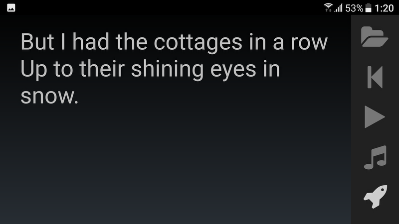

# NearsideDS
Droidscript flashcards with sound application.

This is an example of a DroidScript application that has multiple files.

Main file NearsideDS.js just loads several .js files and publishes the application.

    :::javascript
    app.LoadScript( "NearsideApplication.js" );
    app.LoadScript( "Controller.js" );
    app.LoadScript( "Toolbar.js" );    
    
    function OnStart() {
        var application = new NearsideApplication();
    }

Here is a screenshot:

For more information please read my [blog post](http://sledov.com/nearsideds-droidscript-flashcards-with-sound.htm).
